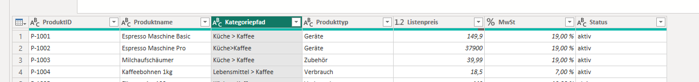

# 1 · Daten einlesen

!!! abstract "Ziel dieses Kapitels"

    Die Velora-Dateien sauber nach Power BI holen – und verstehen, **welche Weichen**
    man dabei stellt: Verbindungsmodus, Trennzeichen, Codierung, Gebietsschema.

## 1.1 Datenquellen im Überblick

Über **Start → Daten abrufen** öffnet sich der Quellenkatalog:

- :material-file-delimited: **Datei:** Excel, **Text/CSV**, JSON, XML, PDF, **Ordner**
- :material-database: **Datenbank:** SQL Server, PostgreSQL, MySQL, Oracle, Access …
- :material-cloud: **Online/Cloud:** SharePoint, OneDrive, **Web/REST-API**, Dataverse
- :material-chart-box: **Power Platform:** Power BI-Datasets, **Dataflows**

!!! merksatz "Merksatz"

    Für eine **einzelne** Datei „Datei", für **viele gleichartige** Dateien immer
    „Ordner". Wer 12 Monatsdateien einzeln einliest, hat schon verloren.

## 1.2 Die wichtigste Weiche: der Verbindungsmodus

| Modus | Was passiert | Wann nutzen |
|---|---|---|
| **Import** | Daten werden **ins Modell kopiert** (komprimiert, schnell) | **Standard** – fast immer im Controlling |
| **DirectQuery** | Jede Abfrage geht **live an die Quelle** | Riesige/aktuelle DB, Daten dürfen das Haus nicht verlassen |
| **Live Connection** | Verbindung zu fertigem Analysis-Services-Modell | Zentrale Unternehmensmodelle |
| **Composite** | Mischung aus Import + DirectQuery | Fortgeschritten |

Für **beide Schulungs-Datensätze** nutzen wir **Import**.

!!! merksatz "Merksatz"

    Im Zweifel **„Import"**. DirectQuery löst ein Problem, das die meisten gar nicht
    haben – und handelt sich dafür viele neue ein.

!!! profi "Profi-Ausblick: DirectQuery & Incremental Refresh"

    In echten Häusern liegt der Umsatz oft in einem **Data Warehouse** (SQL Server,
    Snowflake). Dann lohnt **DirectQuery** oder ein **Composite Model** (große
    Faktentabelle live, kleine Dimensionen importiert). Stichwort für später:
    **Incremental Refresh** – nur neue Monate nachladen statt jedes Mal alles. Für
    unsere CSV-Welt brauchen wir das nicht.

## 1.3 Gemeinsam (Velora): Bestellungen aus dem Ordner einlesen

!!! gemeinsam "Mitmachen am Rechner"

    Öffnen Sie Power BI Desktop. Wir lesen jetzt die vier `Bestellungen_*.csv`
    **in einem Rutsch** ein – Schritt für Schritt zusammen.

1. **Start → Daten abrufen → Mehr… → Ordner**.
2. Pfad zu `velora/` wählen. Power BI zeigt **alle** Dateien – auch `Produkte.csv`,
   `Kunden.csv`, `Umsatzplan_2023.csv`, die wir hier **nicht** wollen.
3. Auf **Daten transformieren** klicken (nicht „Kombinieren"!), um erst zu filtern.
4. Spalte `Name` filtern: **Textfilter → beginnt mit → `Bestellungen`**.
5. Auf den **Doppelpfeil** der Spalte `Content` klicken → Power BI erzeugt automatisch
   eine **Beispieldatei** + eine **Transformationsfunktion** und hängt alle Dateien
   aneinander (*Append*).

!!! merksatz "Merksatz"

    **Erst filtern, dann kombinieren.** „Aus Ordner" nimmt sonst jede Datei mit –
    auch die, die nicht dazugehört.

Nach dem Kombinieren bringt Power BI die Spalte `Source.Name` mit (z. B.
`Bestellungen_Nord.csv`). Daraus machen wir in Kapitel 2 eine saubere Spalte
**Region**. :material-arrow-right-bold: Der Dateiname ist oft selbst wertvolle Information!

!!! profi "Profi-Ausblick: Monatsexporte"

    Genau so liest man **Monatsexporte** ein: `Umsatz_2023-01.csv`, `…-02.csv` … Aus
    dem Dateinamen zieht man **Jahr und Monat**. Voraussetzung: die Quelle benennt
    konsistent. Ein häufiger realer Fehler ist genau das – jemand nennt eine Datei
    `Umsatz_Jan(final)(2).csv`, und der Import stolpert.

## 1.4 Stolperfalle Gebietsschema & Trennzeichen

Beim CSV-Import zeigt Power BI oben drei Felder: **Codierung**, **Trennzeichen**,
**Datentyperkennung** – drei *getrennte* Stellschrauben.

- **Trennzeichen:** Unsere Dateien nutzen ==Semikolon==. Erkennt Power BI das nicht,
  steht alles in *einer* Spalte.
- **Codierung:** Bei falscher Codierung wird aus `München` ein `München`
  → **65001: UTF-8** wählen.
- **Zahlen/Datum:** `2.296,72` ist bei *deutschem* Gebietsschema eine Zahl, bei
  *englischem* Unsinn.

!!! merksatz "Merksatz"

    Punkt oder Komma? Das entscheidet das **Gebietsschema**, nicht die Zahl.
    `2.296,72` ist deutsch *zweitausend…*, englisch *zwei Komma drei*.

### Datentyp „mit Gebietsschema" setzen

Bei kritischen Spalten: **Rechtsklick → Typ ändern → Mit Gebietsschema… →
„Deutsch (Deutschland)"**. So werden `2.296,72` und `28.06.2023` korrekt
interpretiert – auch wenn die Oberfläche auf Englisch läuft. (Das ISO-Datums-Problem
lösen wir in Kapitel 2.)

!!! profi "Profi-Ausblick: gemischte Länder"

    In internationalen Konzernen kommt eine Datei aus den USA (`1,299.00`), die
    nächste aus DE (`1.299,00`). **Verlassen Sie sich nie auf die Automatik.** Setzen
    Sie Datentypen *explizit mit Gebietsschema* – sonst rechnet das Modell mit
    falschen Größenordnungen, bis der Vorstand fragt, warum der Umsatz plötzlich das
    1000-fache ist.

## 1.5 Datenschutzebenen & Zugangsdaten

Beim ersten Zugriff fragt Power BI nach **Zugangsdaten** (Dateien: meist nichts) und
nach **Datenschutzebenen** (*Öffentlich / Organisation / Privat*).

!!! merksatz "Merksatz"

    Wenn eine Abfrage „aus Datenschutzgründen" nicht zusammenführt oder quälend
    langsam wird, sind oft die **Privacy Levels** schuld.

---

## :material-pencil-ruler: Übung

{{ task(file="tasks/01_einlesen.yaml") }}

---

!!! abstract "Wiederholung Kapitel 1"

    - **„Aus Ordner"** statt Einzeldateien; **erst filtern, dann kombinieren**.
    - **Import** ist der Standard-Verbindungsmodus im Controlling.
    - **Trennzeichen, Codierung, Gebietsschema** – drei getrennte Stellschrauben.
    - Der **Dateiname** kann selbst Information tragen (Region, Monat).

??? question "Verständnisfragen zu Kapitel 1"

    1. Warum klicken wir bei „Aus Ordner" zuerst auf **Daten transformieren**?
    2. Aus `München` wird beim Import `München`. Woran liegt's?
    3. Nennen Sie einen Fall, in dem **DirectQuery** sinnvoller ist als **Import**.

    ??? success "Lösungen"

        1. Um **erst zu filtern** (nur `Bestellungen_*`) und Fremddateien
           auszuschließen, bevor automatisch alles aneinandergehängt wird.
        2. Falsche **Codierung** beim Import (z. B. Westeuropäisch statt **UTF-8**).
        3. Sehr große/hochaktuelle Datenbanken oder wenn Daten aus Compliance-Gründen
           nicht ins Modell kopiert werden dürfen.
