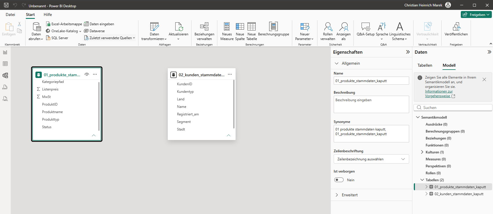
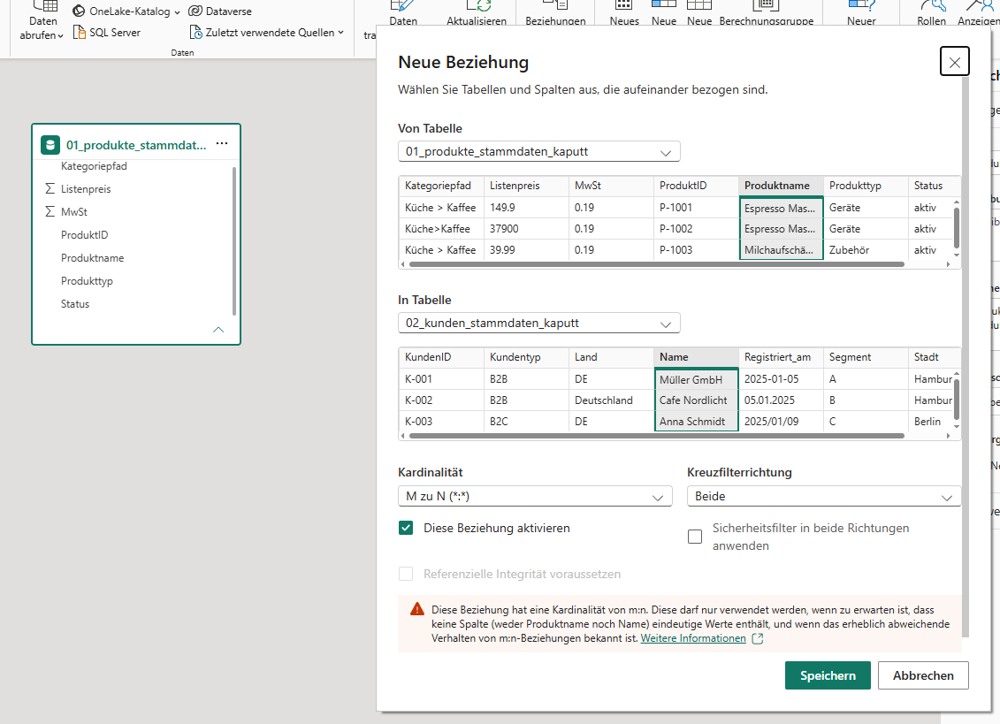
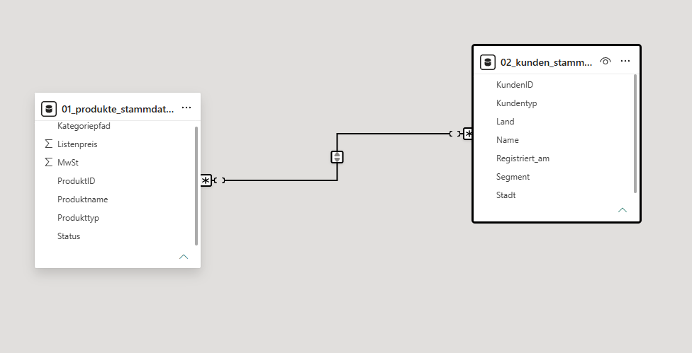
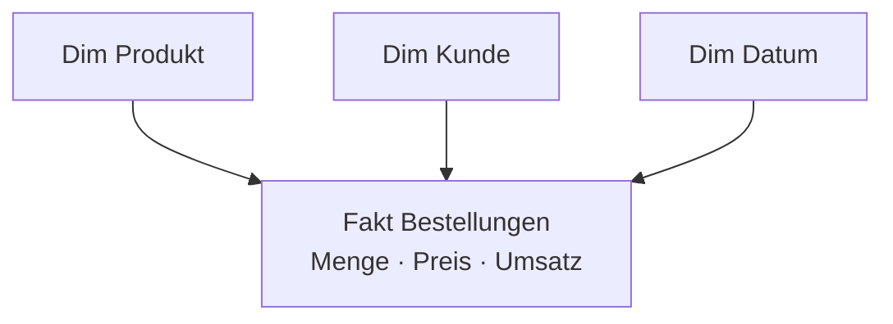

# 3 · Datenmodell erstellen

!!! abstract "Ziel dieses Kapitels"

    Aus sauberen Tabellen wird ein **belastbares Modell**: Sternschema, Beziehungen,
    Kalendertabelle und erste Kennzahlen. **DAX** kommt – wie versprochen – **nur kurz**.

## 3.1 Warum überhaupt modellieren?

Verlockung: alles per Merge in **eine große Tabelle** stopfen. Drei Gründe dagegen:
**Größe** (Stammdaten millionenfach wiederholt), **Pflege** (jede Adressänderung in
jeder Zeile) und **Auswertung** (Filter soll *alle* Fakten erfassen – das leistet
eine Beziehung).

!!! merksatz "Merksatz"

    Eine flache Riesentabelle ist wie ein **Schrank ohne Fächer**: reinwerfen geht
    schnell, wiederfinden nie. Das Modell sind die Fächer.

## 3.2 Das Sternschema (Star Schema)









- **Faktentabelle** (Mitte): die **Ereignisse/Messwerte** – viele Zeilen, schmal,
  v. a. **Schlüssel + Zahlen** (`Bestellungen`).
- **Dimensionstabellen** (außen): **beschreibende Attribute** zum Filtern und
  Gruppieren – wenige Zeilen, breit (`Produkte`, `Kunden`, `Datum`).

!!! merksatz "Merksatz"

    **Fakten sind Zahlen, Dimensionen sind Worte.** Wonach Sie filtern wollen (Kunde,
    Produkt, Monat), gehört in eine Dimension.

!!! merksatz "Merksatz"

    Im Zweifel **Stern statt Schneeflocke**. Jede zusätzliche Tabelle in der Kette ist
    Pflegeaufwand, der sich selten lohnt.

**Granularität:** Bei Velora = **eine Zeile = eine Bestellposition**. Das ist die
feinste sinnvolle Ebene.

!!! merksatz "Merksatz"

    Lieber **zu fein als zu grob** speichern. Verdichten kann man immer, Details
    zurückholen nie.

## 3.3 Gemeinsam (Velora): Beziehungen anlegen

!!! gemeinsam "Mitmachen am Rechner"

    In **Power Query → Schließen & übernehmen** laden wir `Bestellungen`, `Produkte`,
    `Kunden`. Dann wechseln wir gemeinsam in die **Modellansicht**.

1. Beziehung **Bestellungen[ProduktNr] → Produkte[ProduktNr]** ziehen.
2. Beziehung **Bestellungen[KundenNr] → Kunden[KundenNr]** anlegen.

### Kardinalität
- **1:n (Viele-zu-Eins)** – der **Normalfall**: die „1"-Seite ist die **Dimension**,
  die „n"-Seite die **Faktentabelle**.
- **1:1** selten, **n:m** Sonderfall (siehe 3.7).

### Filterrichtung
- **Einfach (1-Richtung)** – der **Standard**: die Dimension filtert die Fakten.
- **Beidseitig** – nur mit konkretem Grund; erzeugt sonst **mehrdeutige Pfade**.

!!! merksatz "Merksatz"

    Der Filter fließt vom **Einen** zu den **Vielen** – von der Dimension in die
    Fakten. Der Pfeil zeigt von der Dimension weg.

!!! merksatz "Merksatz"

    **Bidirektional ist kein Komfort-Schalter, sondern ein Risiko.** Einschalten nur
    mit Grund – nie „vorsichtshalber".

## 3.4 Die Kalender-/Datumstabelle – Pflicht, nicht Kür

Ein eigenes Bestelldatum reicht nicht: Monate ohne Bestellung fehlen, „Vorjahr"
funktioniert nicht, jede Faktentabelle hätte ihren eigenen Datumsbezug. Lösung: **eine
zentrale Datumstabelle**, an die *alle* Fakten andocken.

=== "Variante A · Power Query (M)"

    ```m
    let
        Start = #date(2023,1,1),
        Ende  = #date(2023,12,31),
        Tage  = Duration.Days(Ende - Start) + 1,
        Liste = List.Dates(Start, Tage, #duration(1,0,0,0)),
        Tab   = Table.FromList(Liste, Splitter.SplitByNothing(), {"Datum"})
    in
        Tab
    ```

    Dann Spalten ergänzen: `Jahr`, `Quartal`, `Monatsnummer`, `Monatsname`, `KW`.

=== "Variante B · DAX"

    ```dax
    Datum = CALENDARAUTO()
    ```

    Legt automatisch den passenden Datumsbereich an; Spalten per `FORMAT(...)` ergänzen.

### Zwei Dinge, die man **nie** vergisst

1. **Als Datumstabelle markieren:** *Tabellentools → Als Datumstabelle markieren* →
   Spalte `Datum`. Erst dann funktioniert **Time Intelligence** verlässlich.
2. **Monatsnamen sortieren:** „Jan, Feb …" wird sonst **alphabetisch** sortiert.
   *Spaltentools → Nach Spalte sortieren → Monatsnummer*.
3. Beziehung **Bestellungen[Datum] → Datum[Datum]** anlegen (1:n, einfach).

!!! merksatz "Merksatz"

    Ohne **markierte** Datumstabelle keine saubere Zeitrechnung. Und ohne **„Nach
    Spalte sortieren"** steht der April vor dem Januar.

!!! profi "Profi-Ausblick: echte Controlling-Kalender"

    Echte Kalender brauchen mehr: **Geschäftsjahr** (z. B. Start Juli), **Perioden**,
    **Arbeitstage/Feiertage**, Vorjahres-Mapping. Man pflegt sie zentral, damit *alle*
    Berichte denselben Kalender nutzen. Und: hat die Faktentabelle **zwei** Datumsspalten
    (Bestell- und Lieferdatum), braucht man **zwei Beziehungen** zur selben
    Datumstabelle – eine davon **inaktiv** (siehe 3.7).

!!! merksatz "Merksatz"

    Plan und Ist treffen sich auf der **gröbsten gemeinsamen Ebene** – hier dem Monat.
    Man rechnet Ist auf Monat hoch, nicht Plan auf Tage herunter.

## 3.5 Modell aufräumen & benutzerfreundlich machen

- **Technische Spalten ausblenden** (`KundenNr`, `ProduktNr`): Rechtsklick → *Im
  Bericht ausblenden*.
- **Sprechende Namen** (`Source.Name` → `Region`).
- **Formatierung & Standardaggregation** (Umsatz als € , Rabatt als %).
- **Datenkategorien** (`Ort`/`PLZ`/`Land` als **Geo**) für spätere Karten.
- **Hierarchien** (`Jahr ▸ Quartal ▸ Monat`; `Land ▸ Ort`).
- **Anzeigeordner** für viele Kennzahlen.

!!! merksatz "Merksatz"

    Modellieren heißt auch **aufräumen**. Was der Berichtsbauer nicht sehen muss,
    blendet man aus – ein leerer Schreibtisch arbeitet schneller.

## 3.6 Kennzahlen: berechnete Spalte vs. Measure (kurzer DAX-Teil)

!!! info "Nur das Minimum"

    Hier nur, was für ein Plan-Ist-Modell nötig ist. DAX in der Tiefe ist Stoff einer
    eigenen Aufbau-Schulung.

|  | **Berechnete Spalte** | **Measure** |
|---|---|---|
| Wann berechnet | beim **Aktualisieren**, je Zeile | beim **Anzeigen**, je Filterkontext |
| Gespeichert? | ja (kostet Speicher) | nein (rechnet on the fly) |
| Gut für | zeilenfeste Eigenschaften | **Aggregationen** (Umsatz, DB, Anzahl) |

!!! merksatz "Merksatz"

    Aggregierst du (Summe, Schnitt, Anzahl) → **Measure**. Beschreibst du eine einzelne
    Zeile → berechnete Spalte. **Im Zweifel Measure.**

**Die zwei Kontexte kurz:** **Zeilenkontext** = „aktuelle Zeile" (berechnete Spalte);
**Filterkontext** = die Filter aus Visual/Slicer/Überschrift (Measure). Klick auf
„Österreich" → das Measure rechnet automatisch nur mit AT-Zeilen.

!!! merksatz "Merksatz"

    Ein Measure rechnet immer **„im aktuellen Filter"**. Dieselbe Formel liefert je
    Klick eine andere Zahl – das ist das Schöne daran, nicht das Verwirrende.

### Gemeinsam (Velora): die Kern-Measures

!!! gemeinsam "Mitmachen am Rechner"

    Legen Sie eine leere Tabelle `_Kennzahlen` an (dort sammeln wir alle Measures) und
    tippen Sie die folgenden Formeln gemeinsam mit ein.

```dax
Umsatz = SUMX ( Bestellungen, Bestellungen[Menge] * Bestellungen[Einzelpreis] * (1 - Bestellungen[Rabatt]) )
Einkaufswert = SUMX ( Bestellungen, Bestellungen[Menge] * RELATED ( Produkte[Einkaufspreis] ) )
Deckungsbeitrag = [Umsatz] - [Einkaufswert]
DB-Marge % = DIVIDE ( [Deckungsbeitrag], [Umsatz] )
```

- `SUMX` ist ein **Iterator** – läuft zeilenweise über die Bestellungen und summiert.
- `RELATED` holt den Einkaufspreis über die **Beziehung** aus `Produkte` – der Lohn
  fürs Sternschema.
- `DIVIDE` teilt **gefahrlos** (kein Fehler bei Division durch 0).

```dax
Planumsatz = SUM ( Umsatzplan[Planumsatz] )
Abweichung = [Umsatz] - [Planumsatz]
Zielerreichung % = DIVIDE ( [Umsatz], [Planumsatz] )
```

!!! merksatz "Merksatz"

    Schreibe **explizite** Measures (`Umsatz = …`) statt eine Zahlenspalte ins Visual
    zu ziehen. Explizite Measures sind benannt, wiederverwendbar und an *einer* Stelle
    pflegbar.

!!! merksatz "Merksatz"

    **`DIVIDE` statt „/".** Ein Schrägstrich knallt bei Null, `DIVIDE` liefert sauber leer.

**Time Intelligence – ein Blick:**

```dax
Umsatz VJ = CALCULATE ( [Umsatz], SAMEPERIODLASTYEAR ( Datum[Datum] ) )
```

*(In unserem Ein-Jahres-Datensatz liefert das nichts – es zeigt nur das Prinzip.
Sobald 2024er Daten dazukommen, rechnet es von allein.)*

!!! profi "Profi-Ausblick: was bei DAX noch kommt"

    Reale DAX-Themen, die hier offen bleiben: `CALCULATE` mit mehreren Filtern,
    `USERELATIONSHIP` für inaktive Beziehungen, sich gegenseitig aufrufende Measures
    und das Tücken-Thema **Filterkontext vs. Kontextübergang**. Eine eigene
    Aufbau-Schulung wert.

## 3.7 Häufige Modellierungsprobleme & elegante Lösungen

| Problem | Symptom | Elegante Lösung |
|---|---|---|
| **Mehrere Faktentabellen** (Ist + Plan) | „Wie verbinde ich beide?" | **Konforme Dimensionen**: beide an *dieselbe* `Datum`-/`Produkt`-Dimension |
| **n:m-Beziehung** | lässt sich nicht als 1:n anlegen | **Brückentabelle** mit eindeutigen Schlüsseln |
| **Rollenspielende Dimension** (Bestell-/Lieferdatum) | nur ein Datum filtert | zweite Beziehung **inaktiv** + `USERELATIONSHIP` |
| **Mehrdeutige Pfade** | „ambiguous"-Warnung | bidirektionale Filter vermeiden, sauberer Stern |
| **Fehlende Schlüssel** (null ProduktNr) | Umsatz „ohne Produkt" verschwindet | **„Unbekannt"-Zeile** in der Dimension, `null` darauf mappen |
| **Modell zu groß/langsam** | Datei riesig, Refresh träge | unnötige Spalten raus, **Kardinalität senken** |

!!! merksatz "Merksatz"

    Plan und Ist reden **nicht direkt** miteinander – sie reden über **gemeinsame
    Dimensionen** (Datum, Produkt). Das ist die „konforme Dimension".

!!! profi "Profi-Ausblick: VertiPaq & Kardinalität"

    Power BI komprimiert spaltenweise (VertiPaq). Die **Anzahl unterschiedlicher Werte**
    einer Spalte (Kardinalität) ist der größte Hebel: eine `Zeitstempel`-Spalte mit
    Millisekunden ist ein Speicherfresser; auf reines Datum gekürzt schrumpft das Modell
    drastisch. **Schmal schlägt breit, wenige Werte schlagen viele.**

## 3.8 Qualitätssicherung & Dokumentation

- **Plausibilität:** stimmt die Umsatzsumme grob mit einer Excel-Gegenrechnung?
- **Datenqualität in Power Query:** *Ansicht → Spaltenqualität / -verteilung / -profil*.
- **Beziehungen prüfen:** geht von **jeder** Dimension *ein* Pfeil in die Fakten? Gibt
  es unverbundene Inseln?
- **Annahmen dokumentieren** (leerer Rabatt = 0 %, fehlende ProduktNr = Unbekannt).

!!! merksatz "Merksatz"

    Ein Modell ist erst fertig, wenn ein **Kollege es ohne Sie versteht**. Annahmen,
    die nur im Kopf stehen, sind nicht dokumentiert.

---

## :material-pencil-ruler: Übungen

{{ task(file="tasks/03_modell.yaml") }}

{{ task(file="tasks/03_measures.yaml") }}

---

!!! abstract "Wiederholung Kapitel 3"

    - **Sternschema:** Fakten (Zahlen) zentral, Dimensionen (Worte) außen.
    - Beziehungen **1:n, einfach gerichtet**; bidirektional nur mit Grund.
    - **Datumstabelle**: erzeugen → **markieren** → Monat **nach Nummer sortieren** → verbinden.
    - **Measures** für Aggregationen; `SUMX`, `RELATED`, `DIVIDE`, `CALCULATE` als Vokabular.
    - Plan + Ist über **konforme Dimensionen**, nie direkt.
    - **Aufräumen, prüfen, dokumentieren** gehört zum Modell.

??? question "Verständnisfragen zu Kapitel 3"

    1. In einer 1:n-Beziehung – welche Tabelle ist „1", welche „n"?
    2. „Vorjahr" liefert Quatsch. Welche **zwei** Modellvoraussetzungen prüfen Sie zuerst?
    3. Warum sortieren Monatsnamen ohne Zutun falsch – und wie behebt man es?
    4. Wann **Measure**, wann **berechnete Spalte**?
    5. Wie verbindet man **Plan-** und **Ist-Tabelle** sauber?

    ??? success "Lösungen"

        1. Die **Dimension** ist „1", die **Faktentabelle** „n".
        2. (a) Ist die **Datumstabelle als Datumstabelle markiert**? (b) Besteht eine
           **aktive Beziehung** zwischen Faktdatum und Datumstabelle?
        3. Sie werden als **Text alphabetisch** sortiert. Lösung: **Nach Spalte
           sortieren → Monatsnummer**.
        4. Measure für **Aggregationen** (rechnet im Filterkontext, kein Speicher);
           berechnete Spalte für **zeilenfeste** Eigenschaften.
        5. Über **konforme Dimensionen** (beide an dieselbe `Datum`-/`Produkt`-Dimension).
