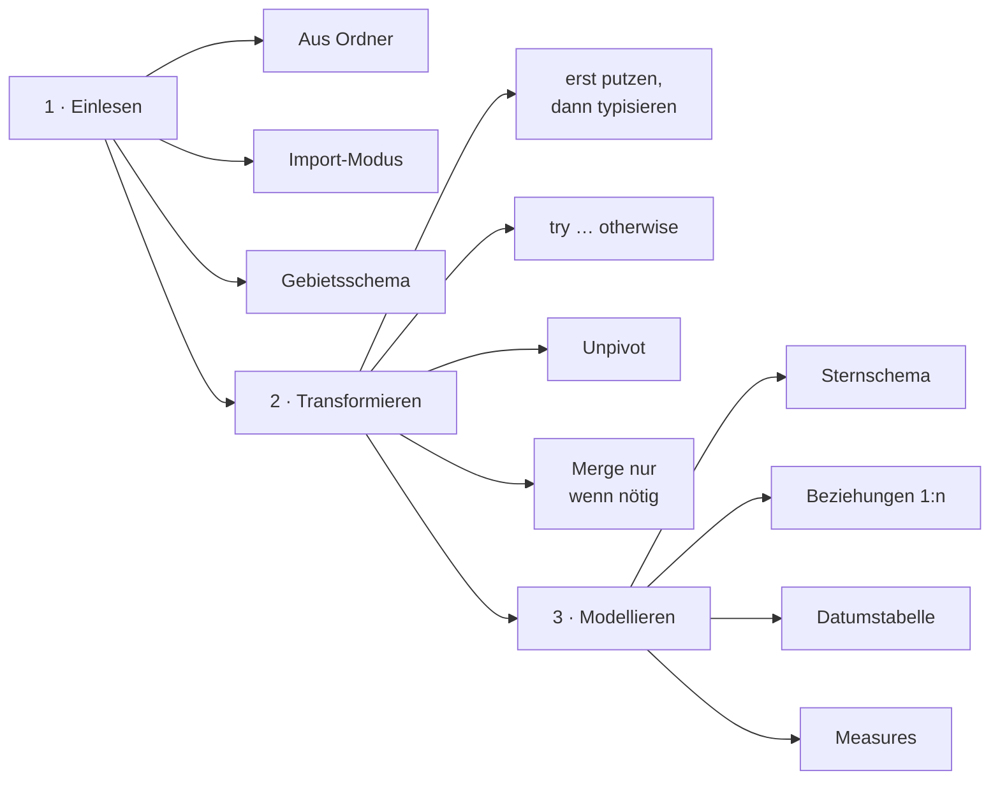

# 4 · Abschluss & Checkliste

!!! success "Am Ziel"

    Ein sauberes, dokumentiertes **Datenmodell** steht. Ab hier geht es mit
    **Visualisierung und Dashboards** weiter – das ist Thema eines **späteren Teils
    der Schulung**, der auf genau diesem Modell aufbaut.

## 4.1 Abnahme-Checkliste „Modell ist bereit"

Erst wenn alles abgehakt ist, ist das Modell übergabereif:

**:material-database-import: Einlesen**

- [ ] Alle Quelldateien per **„Aus Ordner"** eingelesen, Fremddateien herausgefiltert
- [ ] Trennzeichen, Codierung (UTF-8) und **Gebietsschema** korrekt

**:material-auto-fix: Transformieren**

- [ ] Datentypen explizit gesetzt (Zahlen/Datum **mit Gebietsschema**)
- [ ] Datum **robust geparst** (gemischte Formate abgefangen)
- [ ] Textspalten **getrimmt/vereinheitlicht** (Kategorie/Warengruppe sauber)
- [ ] **Dubletten** entfernt, **fehlende Schlüssel** bewusst behandelt
- [ ] Plan **entpivotiert** (lange Tabelle statt Monatsspalten)
- [ ] Schritte **benannt**, Abfragen gruppiert, Hilfsabfragen **nicht geladen**

**:material-star-four-points: Modellieren**

- [ ] **Sternschema**: Fakten zentral, Dimensionen außen
- [ ] Beziehungen **1:n, einfach gerichtet**, keine mehrdeutigen Pfade
- [ ] **Datumstabelle** erzeugt, **markiert**, Monat **nach Nummer sortiert**, verbunden
- [ ] **Kern-Measures** definiert und gegen eine Handrechnung geprüft
- [ ] **Plan-Ist** über konforme Dimensionen rechenbar
- [ ] Technische Spalten **ausgeblendet**, Namen/Formate sauber, Geo-Kategorien gesetzt
- [ ] **Annahmen dokumentiert**

!!! merksatz "Merksatz"

    **Fertig** heißt nicht „die Zahlen erscheinen", sondern „die Zahlen **stimmen**,
    sind **nachvollziehbar** und morgen **automatisch aktualisierbar**".

## 4.2 Die roten Fäden der Schulung

1. **Reihenfolge ist alles:** Einlesen → Transformieren → Modellieren.
2. **Erst putzen, dann typisieren, dann modellieren.**
3. **Robust statt fragil:** `try … otherwise`, „Andere Spalten …", Trim/Clean.
4. **Breit ist für Menschen, lang ist für Maschinen** → Unpivot.
5. **Beziehung statt Merge, Stern statt Schneeflocke.**
6. **Datumstabelle ist Pflicht** – markieren und Monat nach Nummer sortieren.
7. **Measures für Aggregationen**, `DIVIDE` statt „/".
8. **Aufräumen und Dokumentieren** ist Teil der Arbeit, nicht Kür.

## 4.3 Ausblick: Was als Nächstes kommt

!!! note "Themen der nächsten Teile der Schulung"

    - :material-chart-box: **Visuals & Berichte:** Diagramme, Matrizen, KPI-Karten.
    - :material-cursor-default-click: **Interaktivität:** Slicer, Drillthrough, Tooltips, Lesezeichen.
    - :material-cloud-upload: **Dashboards & Verteilung:** Power BI Service, Refresh-Zeitpläne, Apps.
    - :material-function-variant: **Aufbau-DAX:** `CALCULATE` in der Tiefe, Time Intelligence.

!!! merksatz "Merksatz"

    Ein gutes Dashboard ist nur so gut wie das **Modell** darunter. Wer diese Schulung
    beherrscht, hat den schwierigen **80-%-Teil** schon erledigt.

---

!!! quote "Viel Erfolg!"

    Sie haben jetzt das Handwerkszeug, um aus jeder „schmutzigen" Dateisammlung ein
    belastbares Modell zu bauen. Üben Sie es am **Bürotech**-Datensatz – und dann an
    Ihren echten Controlling-Daten. :material-rocket-launch:
