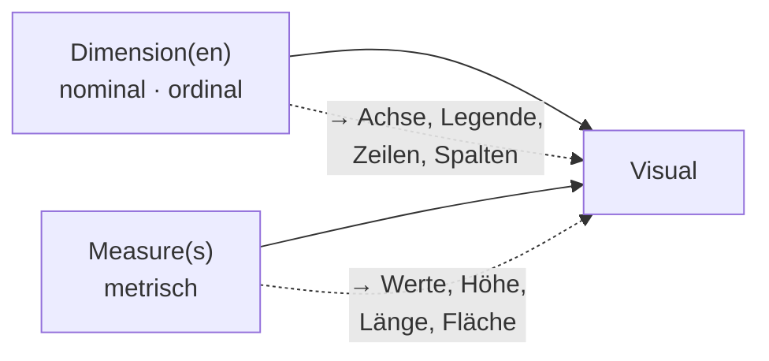

# 5 · Visualisierung

!!! abstract "Ziel dieses Kapitels"

    **Teil 2 beginnt hier.** Das Datenmodell steht – jetzt machen wir aus Zahlen
    **Bilder**, die eine Führungskraft in Sekunden versteht. Leitfrage: nicht „was ist
    möglich", sondern **„was ist verständlich"**.

## 5.1 Vom Modell zum Bild

In Teil 1 haben wir alles gebaut, was ein Visual braucht: **Dimensionen** (Kunde,
Produkt, Datum – die „Worte", nach denen man filtert) und **Measures** (`Umsatz`,
`Deckungsbeitrag`, `Zielerreichung %` – die „Zahlen", die gerechnet werden). Ein Visual
ist im Kern immer dasselbe Rezept:

!!! merksatz "Merksatz"

    **Dimensionen kommen auf die Achse, Measures in die Werte.** Wer das trennt, hat
    schon halb das richtige Diagramm.

## 5.2 Skalenniveaus von Variablen

Nicht jede Zahl ist eine „Zahl", und nicht jeder Text ist gleich. Das **Skalenniveau**
sagt, was man mit einer Variablen sinnvoll tun darf – und damit, wie man sie zeigt.

| Skalenniveau | Bedeutung | Erlaubt | Velora-Beispiel |
|---|---|---|---|
| **Nominal** | Kategorien **ohne** Reihenfolge | unterscheiden, zählen | `Land`, `Kunde`, `Kategorie`, `Region` |
| **Ordinal** | Kategorien **mit** Reihenfolge, ohne festen Abstand | ordnen, Rang bilden | `Preisklasse`, `Monat` |
| **Metrisch** | echte Zahlen mit gleichen Abständen | rechnen (Summe, Mittel) | `Menge`, `Einzelpreis`, `Umsatz` |

- **Nominal** – *nur Namen.* „Nord" ist nicht mehr oder weniger als „Süd". Zählen und
  gruppieren ja, „mitteln" nein.
- **Ordinal** – *geordnet, aber ohne Maß.* Der `Monatsname` ist das Musterbeispiel: eine
  **Reihenfolge** gibt es (deshalb „Nach Spalte sortieren" aus Kapitel 3!), aber
  „Februar minus Januar" ergibt keinen Sinn.
- **Metrisch** – *echte Messwerte.* Nur hier darf man **summieren und mitteln** – also
  genau das, was ein Measure tut. Deshalb sind fast alle Measures metrisch.

!!! merksatz "Merksatz"

    **Das Skalenniveau bestimmt das Diagramm.** Nominal/ordinal geben die Achse,
    metrisch gibt die Höhe. Wer nur nach „sieht schön aus" wählt, wählt falsch.

!!! profi "Profi-Ausblick: die feineren Abstufungen"

    Metrisch teilt sich in **Intervall**- und **Verhältnisskala** (Verhältnis hat einen
    echten Nullpunkt, z. B. Umsatz; Intervall nicht, z. B. °C – „doppelt so warm" ist
    unsinnig); zusätzlich trennt man **diskret** (zählbar) von **stetig** (messbar). Für
    Controlling reicht die Dreiteilung nominal / ordinal / metrisch in ~95 % der Fälle –
    die feineren Stufen werden erst in Statistik-lastigen Analysen relevant.

## 5.3 Tabellen und Diagramme – uni-, bi- und multivariat

Die zweite Entscheidungsachse: **Wie viele Variablen** zeige ich gleichzeitig?

| Art | Variablen | Frage | Typische Visuals |
|---|---|---|---|
| **Univariat** | **eine** | „Wie hoch/verteilt ist X?" | KPI-Karte, einzelner Balken, Histogramm |
| **Bivariat** | **zwei** | „Wie hängt X von Y ab?" | Säulen/Balken, Linie, Streudiagramm |
| **Multivariat** | **drei +** | „Wie wirken mehrere Einflüsse zusammen?" | gestapelte Säulen, Matrix, kleine Vielfache |

- **Univariat** ist der Einstieg: *ein* Measure ohne Aufteilung – `Umsatz gesamt` als
  große **KPI-Karte**.
- **Bivariat** ist der Alltag: `Umsatz` **je** `Kategorie` (Säulen), `Umsatz` **über**
  `Datum` (Linie), `Umsatz` **gegen** `Deckungsbeitrag` (Streuung).
- **Multivariat** verdichtet mehr Information: `Umsatz` je `Kategorie` **und** `Region`
  (gruppierte Säulen) oder eine **Matrix**. Vorsicht: Jede weitere Variable kostet
  Lesbarkeit.

!!! merksatz "Merksatz"

    Eine Variable beantwortet „wie viel", zwei „wovon abhängig", drei fangen an zu
    **erklären** – und ab vier fängt es an zu **verwirren**.

## 5.4 Gemeinsam (Velora): das erste Dashboard, Schritt für Schritt

!!! gemeinsam "Mitmachen am Rechner"

    Wir bauen bewusst **vom Einfachen zum Reichen** – genau die Reihenfolge, die auch
    die Best-Practice (5.5) empfiehlt.

1. **Univariat, als Tabelle:** Visual **Tabelle**, `Kategorie` + `[Umsatz]`. Zuerst eine
   Tabelle, weil man die **Zahlen lesen und gegen eine Handrechnung prüfen** kann.
2. **Bivariat, als Säulen:** dieselben Felder ins **gruppierte Säulendiagramm** –
   `Kategorie` auf die Achse, `[Umsatz]` in die Werte.
3. **Die Zeit dazu:** **Liniendiagramm** mit `Datum[Monat]` (korrekt sortiert!) und
   `[Umsatz]`.
4. **Dritte Dimension:** `Region` als **Legende** ins Säulendiagramm → multivariat.
5. **Kernaussage als KPI:** zwei **Karten** mit `[Umsatz]` und `[Zielerreichung %]`.
6. **Interaktiv:** ein **Datenschnitt (Slicer)** auf `Datum[Quartal]` oder
   `Kunden[Land]` – ein Klick filtert **alle** Visuals. Das ist der Lohn des sauberen
   Sternschemas: Der Filter fließt von der Dimension in die Fakten.

!!! merksatz "Merksatz"

    **Erst die Tabelle (zum Prüfen), dann das Diagramm (zum Zeigen).** Wer mit dem
    hübschen Bild anfängt, merkt Rechenfehler zuletzt.

## 5.5 Best Practices & Styleguide – „Weniger ist mehr"

Der empfohlene Bauweg für **jedes** Visual und **jede** Seite:

1. **Beginne mit einer Tabelle und einer Metrik.** Erst wenn die *Zahl stimmt*, geht es
   weiter.
2. **Füge dann weitere Variablen hinzu** – eine nach der anderen. Nach jedem Schritt
   fragen: „Sagt das Bild jetzt *mehr* – oder nur *mehr durcheinander*?"
3. **Denke dann an weitere Dimension Tables.** Fehlt eine Auswertungsachse, ergänzt man
   sie **im Modell** und legt die **Beziehung** an – nicht per Krücke im Visual.
4. **Weniger ist mehr.** Lieber **drei klare Visuals** als zwölf, die sich übertönen.

**Diagrammtyp nach Zweck wählen:**

| Ziel | Nimm | Nicht |
|---|---|---|
| Werte **vergleichen** | Balken/Säulen | 3D, Torte mit vielen Segmenten |
| Verlauf **über Zeit** | Linie | Balken pro Tag |
| **Anteil** (wenige Teile) | Balken (Torte ≤ 3–4) | Torte mit 10 Segmenten |
| **Zusammenhang** zweier Zahlen | Streudiagramm | – |
| **eine** wichtige Zahl | KPI-Karte | ganze Tabelle |

Dazu: **Farbe hat eine Bedeutung** oder gar keine (Ampel ja, Regenbogen-Deko nein);
**sprechende Namen** aus dem Modell zahlen sich aus (Achse „Umsatz", nicht
„Summe von Betrag_2"); **kein 3D, keine Effekte**; **Titel als Aussage** („Umsatz je
Region – Nord führt").

!!! merksatz "Merksatz"

    Ein Dashboard ist gelungen, wenn man **nichts mehr weglassen** kann – nicht, wenn man
    nichts mehr hinzufügen kann.

!!! profi "Profi-Ausblick: was in echten Berichten dazukommt"

    Ein zentrales **Farb-/Theme-File** (JSON) fürs Corporate Design, **Barrierefreiheit**
    (Kontraste, nicht nur Farbe zur Codierung, Alternativtexte), **bedingte Formatierung**
    über DAX-Measures, **Lesezeichen** und **Drillthrough** für geführte Analysepfade –
    und ein Auge auf **Performance**: Ein Streudiagramm mit 100 000 Punkten oder zu viele
    Visuals pro Seite bremsen jeden Bericht.

---

## :material-pencil-ruler: Übungen

{{ task(file="tasks/05_skalenniveau.yaml") }}

{{ task(file="tasks/05_visuals.yaml") }}

---

!!! abstract "Wiederholung Kapitel 5"

    - **Dimension → Achse, Measure → Werte** – das Grundrezept jedes Visuals.
    - **Skalenniveau** entscheidet den Diagrammtyp: nominal/ordinal ordnet, metrisch wird
      gerechnet und gezeigt.
    - **Uni → bi → multivariat:** eine Variable, zwei, dann mehr.
    - **Erst Tabelle (prüfen), dann Diagramm (zeigen).**
    - **Weniger ist mehr:** klarer Diagrammtyp, sparsame Farbe, sprechende Namen,
      aussagende Titel.
    - Fehlt eine Auswertungsachse → **Dimension im Modell** ergänzen, nicht im Visual
      tricksen.

??? question "Verständnisfragen zu Kapitel 5"

    1. Welches Skalenniveau haben `Region`, `Preisklasse` und `Umsatz`?
    2. Warum darf man den `Monatsnamen` nicht wie eine nominale Variable behandeln?
    3. Sie wollen den **Umsatzverlauf über das Jahr** zeigen – welcher Diagrammtyp?
    4. Was ist der Unterschied zwischen bivariat und multivariat – je ein Beispiel?
    5. Warum empfiehlt sich, ein Visual **als Tabelle** zu beginnen?

    ??? success "Lösungen"

        1. `Region` = **nominal**, `Preisklasse` = **ordinal**, `Umsatz` = **metrisch**.
        2. Weil er eine **Reihenfolge** hat (Jan < Feb …). Nominal behandelt wird er
           **alphabetisch** sortiert (Apr vor Jan) – daher „Nach Spalte sortieren" auf
           die Monatsnummer.
        3. Ein **Liniendiagramm**, `Datum` auf der Achse, `[Umsatz]` in den Werten.
        4. **Bivariat** = zwei Variablen (`Umsatz` je `Kategorie`); **multivariat** =
           drei + (`Umsatz` je `Kategorie` **und** `Region`).
        5. Weil man die **Zahlen gegen eine Handrechnung prüfen** kann, bevor ein Diagramm
           sie optisch glättet. Erst korrekt, dann hübsch.
