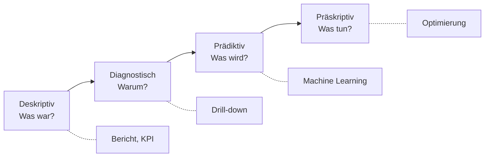

# 6 · Machine Learning und Künstliche Intelligenz

!!! abstract "Ziel dieses Kapitels"

    Bis hierhin haben wir beschrieben, **was war**. ML und KI beginnen bei
    **„was wird sein?"** und **„warum ist es so?"**. Wichtig: KI ist **kein Ersatz** für
    ein sauberes Modell – sie ist eine Schicht **obendrauf**.

## 6.1 Einordnung: die vier Reifegrade der Analyse

Analysen werden mit steigendem Reifegrad wertvoller – und schwieriger:

Kapitel 1–5 haben uns über die **deskriptive** (und mit Drill-down/Slicern die
**diagnostische**) Stufe gebracht. ML/KI ist der Sprung zur **prädiktiven** und
**präskriptiven** Ebene.

!!! merksatz "Merksatz"

    Erst wissen, **was war**, dann raten, **was kommt**. Eine Prognose auf schmutzigen
    Daten ist nur ein präzise berechneter Irrtum.

## 6.2 Arten von Modellen

Es gibt viele Modelle – angefangen bei der einfachsten, der **linearen Regression** (sie
legt eine Gerade durch Punkte: „steigt das Werbebudget um X, steigt der Umsatz im Schnitt
um Y"). Die große Einteilung:

| Familie | Zielgröße? | Was passiert? | Controlling-Beispiel |
|---|---|---|---|
| **Supervised Learning** | **ja** (Label bekannt) | aus Beispielen lernen, dann vorhersagen | Umsatzprognose, „zahlt der Kunde pünktlich?" |
| **Unsupervised Learning** | **nein** | Struktur/Gruppen selbst finden | Kundensegmente, Ausreißer erkennen |
| **Generative KI** | – | **neue Inhalte** erzeugen | Text-Zusammenfassung, DAX-Vorschlag, Bild |

- **Supervised** („überwacht") lernt aus Daten **mit bekannter Antwort** und teilt sich
  in **Regression** (Ziel ist eine **Zahl** – die lineare Regression ist ihr einfachster
  Vertreter) und **Klassifikation** (Ziel ist eine **Kategorie**, z. B. Kunde churnt
  ja/nein).
- **Unsupervised** („unüberwacht") bekommt **keine** Antwort und sucht selbst Muster –
  **Clustering** (ähnliche Fälle gruppieren) und **Anomalieerkennung** (das Ungewöhnliche
  finden).
- **Generative KI** erzeugt **neue** Inhalte statt eine Zahl/Klasse – Texte, Code, Bilder.
  Genau darauf baut **Copilot** auf (→ Kapitel 7).

!!! merksatz "Merksatz"

    **Supervised lernt aus Antworten, unsupervised sucht Fragen, generativ schreibt neue
    Sätze.** Wer die drei unterscheidet, versteht 90 % der KI-Schlagzeilen.

!!! profi "Profi-Ausblick: Training, Overfitting & Kausalität"

    Jedes Modell braucht **Training** (aus Vergangenheitsdaten lernen) und **Validierung**
    (an ungesehenen Daten prüfen). Zwei Klassiker der Enttäuschung: **Overfitting** (das
    Modell hat die alten Daten auswendig gelernt, aber nichts verstanden) und
    **Model Drift** (die Welt ändert sich, das Modell veraltet). Und die goldene Regel:
    **Korrelation ist keine Kausalität** – „Umsatz und Speiseeisverkauf steigen zusammen"
    heißt nicht, dass das eine das andere verursacht.

## 6.3 Wo in Power BI findet man ML und KI?

Man muss kein Data Scientist sein: Power BI bringt fertige KI-Bausteine mit – auf **drei
Ebenen**.

=== "A · In Power Query (beim Aufbereiten)"

    - **„Spalte aus Beispielen"** – kennen Sie aus Kapitel 2; im Hintergrund lernt Power
      BI die Regel aus Ihren Beispielen (ein Hauch ML).
    - **Textanalyse & Bildinhalte** (Stimmung, Schlüsselwörter, Objekterkennung) über
      **Azure Cognitive Services** – Premium.
    - **R-/Python-Skripte** als Transformationsschritt für eigene Modelle.

=== "B · In der Berichtsansicht (KI-Visuals)"

    - **Schlüsseleinflussfaktoren** – erklärt, **was** einen Wert nach oben/unten treibt.
    - **Zerlegungsbaum** – interaktives Aufbrechen einer Kennzahl nach Dimensionen.
    - **Q&A** – Fragen in **natürlicher Sprache** („Umsatz je Region 2023").
    - **Intelligente Erzählung** – automatischer **Text**, der den Bericht zusammenfasst.
    - **Prognose** – verlängert Zeitreihen (exponentielle Glättung) inkl. Konfidenzband.
    - **Anomalieerkennung** & **Clustering** im Streudiagramm.

=== "C · Im Service / Azure (Modelle trainieren)"

    - **AutoML in Dataflows** (Premium) – trainiert ohne Code ein Vorhersagemodell.
    - **Azure Machine Learning** – professionelle Modelle andocken.

!!! merksatz "Merksatz"

    KI in Power BI ist ein **Knopf, kein Zauber.** Sie beschleunigt die Analyse – die
    Verantwortung fürs Interpretieren bleibt beim Menschen.

## 6.4 Gemeinsam (Velora): KI-Visuals ausprobieren

!!! gemeinsam "Mitmachen am Rechner"

    Drei KI-Bausteine ohne eine Zeile Code – und jeder wird gegengeprüft.

- **Schlüsseleinflussfaktoren:** `[Deckungsbeitrag]` als „Analysieren", `Kategorie`,
  `Region`, `Land` als „Erklären". Welcher Faktor hebt/senkt den DB?
- **Prognose:** auf dem Liniendiagramm `Umsatz je Monat` → *Analysebereich → Prognose*,
  z. B. 3 Perioden. *(Im Ein-Jahres-Datensatz fachlich dünn – wie die Time Intelligence
  in Kapitel 3 zeigt sie nur das **Prinzip**.)*
- **Intelligente Erzählung:** den automatisch erzeugten Text gegen die Visuals prüfen –
  stimmen die Aussagen?

!!! merksatz "Merksatz"

    Vertraue keiner KI-Aussage, die du **nicht selbst gegenprüfen** kannst. „Klingt
    plausibel" ist kein Beleg.

---

## :material-pencil-ruler: Übungen

{{ task(file="tasks/06_ki.yaml") }}

---

!!! abstract "Wiederholung Kapitel 6"

    - **Reifegrade:** deskriptiv → diagnostisch → **prädiktiv** → präskriptiv.
    - **Drei Modellfamilien:** **supervised** (mit Label), **unsupervised** (ohne Label),
      **generativ** (neue Inhalte). Einfachster Anfang: **lineare Regression**.
    - **KI in Power BI** auf drei Ebenen: Power Query, KI-Visuals, Service/Azure.
    - **Garbage in, garbage out:** KI ersetzt kein sauberes Modell.
    - **Korrelation ≠ Kausalität**, jede KI-Aussage will gegengeprüft werden.

??? question "Verständnisfragen zu Kapitel 6"

    1. Was unterscheidet **supervised** von **unsupervised** Learning?
    2. Ist eine **Umsatzprognose** Regression oder Klassifikation – und warum?
    3. Nennen Sie zwei KI-Funktionen, die in Power BI **ohne Code** nutzbar sind.
    4. Warum ist eine Prognose auf **nur einem Jahr** Daten mit Vorsicht zu genießen?
    5. Was heißt „Korrelation ist keine Kausalität" – mit einem Beispiel?

    ??? success "Lösungen"

        1. **Supervised** lernt aus Daten **mit bekannter Antwort** (Label) und sagt diese
           vorher; **unsupervised** bekommt **keine** Antwort und sucht selbst Muster.
        2. **Regression** – das Ziel ist eine **Zahl** (erwarteter Umsatz), keine
           Kategorie.
        3. z. B. **Schlüsseleinflussfaktoren**, **Prognose**, **Q&A**, **Intelligente
           Erzählung**, **Zerlegungsbaum** (zwei genügen).
        4. Es fehlt **Historie**: Saison- und Trendmuster lassen sich aus einem Jahr kaum
           verlässlich schätzen; das Modell rät im Grunde.
        5. Zwei Größen können **gemeinsam** steigen, ohne dass eine die andere
           **verursacht** (Speiseeis- und Sonnenbrandzahlen steigen im Sommer beide –
           Ursache ist die Hitze).
