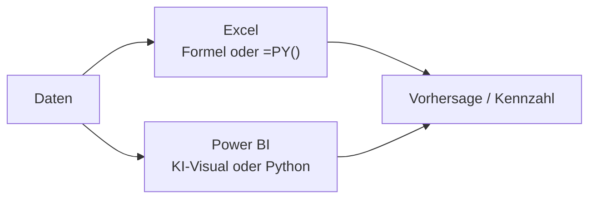

# 8 · Machine Learning in Excel und Power BI

!!! abstract "Ziel dieses Kapitels"

    Kapitel 6 hat erklärt, **was** ein Modell ist – jetzt wird gerechnet. Wir bauen die
    **lineare Regression** dort, wo Controller ohnehin sitzen: erst in **Excel** (mit
    Formeln und einer Zeile **Python**), dann in **Power BI** (fertige KI-Bausteine und
    eigene **Python-Skripte**). Kein Data-Science-Studium nötig – aber dieselbe Sorgfalt
    wie beim Datenmodell aus Teil 1.

## 8.1 Wo rechnet das Modell eigentlich?

Ein Modell ist nur eine Formel, die aus Eingaben eine Zahl macht. Die Frage ist, **wo**
diese Formel läuft – und genau da unterscheiden sich unsere vier Wege:



| Weg | Werkzeug | Code nötig? | Wofür im Controlling |
|---|---|---|---|
| **Excel-Formeln** | `TREND`, `RGP`, Trendlinie | **nein** | schnelle Trendschätzung, ein Wert |
| **Python in Excel** | `=PY(...)` | ja (wenig) | Regression, Statistik, Charts |
| **KI in Power BI** | Key Influencers, AutoML | **nein** | Treiber & Prognose im Bericht |
| **Python in Power BI** | Skript-Quelle & -Visual | ja | eigene Modelle, Spezial-Charts |

!!! merksatz "Merksatz"

    **Erst das einfachste Werkzeug, das die Frage beantwortet.** Eine Trendlinie in Excel
    schlägt ein Deep-Learning-Modell, das niemand versteht.

## 8.2 Lineare Regression in Excel

Die lineare Regression legt eine **Gerade** durch Punkte: `y = m·x + b`. Excel bietet
dafür drei Wege – vom Klick bis zur vollen Statistik.

=== "A · Trendlinie im Diagramm (Klick)"

    Punktdiagramm (`x` = Werbebudget, `y` = Umsatz) → Rechtsklick auf einen Punkt →
    **Trendlinie hinzufügen** → *Linear* → **Formel und Bestimmtheitsmaß (R²) anzeigen**.
    In Sekunden hat man Steigung, Achsenabschnitt und Modellgüte im Bild.

=== "B · Formeln (ein Wert)"

    - `=STEIGUNG(y;x)` → **m** (SLOPE): „pro +1 x steigt y um m".
    - `=ACHSENABSCHNITT(y;x)` → **b** (INTERCEPT).
    - `=PROGNOSE.LINEAR(neu_x; y; x)` → sagt **y für ein neues x** voraus (FORECAST.LINEAR).
    - `=BESTIMMTHEITSMASS(y;x)` → **R²** (RSQ), wie gut die Gerade passt (0–1).

=== "C · RGP & Analyse-ToolPak (volle Statistik)"

    - `=RGP(y;x;WAHR;WAHR)` (LINEST) als **Matrixformel** liefert Steigung, Achsenabschnitt,
      Standardfehler und R² auf einen Schlag.
    - **Datenanalyse → Regression** (Add-In *Analyse-Funktionen* aktivieren) erzeugt einen
      kompletten Report inkl. **p-Werten** und **Konfidenzintervallen** – wie in einer
      Statistik-Software.

!!! merksatz "Merksatz"

    **R² sagt, wie gut die Gerade passt – nicht, ob der Zusammenhang echt ist.** Ein hohes
    R² auf Zufallsdaten bleibt Zufall (→ Korrelation ≠ Kausalität, Kapitel 6).

## 8.3 Python in Excel

Seit **Python in Excel** (Microsoft 365) schreibt man Python **direkt in eine Zelle** mit
`=PY(...)`. Der Code läuft **nicht lokal**, sondern sicher in der **Microsoft-Cloud** (Azure
Container mit der Anaconda-Distribution) – die Bibliotheken **pandas**, **statsmodels**,
**scikit-learn**, **matplotlib** und **seaborn** sind schon da.

```python
# In einer Zelle: =PY( ... ) — Zellbereich via xl() als DataFrame holen
df = xl("A1:C200", headers=True)
import statsmodels.formula.api as smf
modell = smf.ols("Umsatz ~ Werbebudget", data=df).fit()
modell.params            # Achsenabschnitt & Steigung
modell.rsquared          # R²
```

- Ein Zellbereich wird mit **`xl("A1:C200"; headers=True)`** zum **pandas-DataFrame** – die
  Brücke zwischen Tabelle und Code.
- Das Ergebnis bleibt als **Python-Objekt** in der Zelle oder wird als Werte/Diagramm
  **ausgegeben** (Rechtsklick → *Ausgabe als …*).
- Ein `seaborn.regplot(...)` zeichnet Streudiagramm **plus** Regressionsgerade in einem Aufruf.

!!! profi "Profi-Ausblick: Rechenort und Datenschutz"

    Weil der Code in der **Cloud** läuft, verlassen die markierten Zellinhalte kurz Ihren
    Rechner. Für Controlling-Daten heißt das: **Governance klären**, bevor echte Umsätze
    hochgeladen werden (dieselbe Frage wie bei Copilot, Kapitel 7). Kein Internet, keine
    passende Lizenz → kein `=PY()`. Dann bleiben die **Formeln** aus 8.2, die rein lokal rechnen.

## 8.4 ML in Power BI – die fertigen Bausteine

In Power BI muss man für die Standardfälle **nichts** programmieren (Wiederholung zu
Kapitel 6, jetzt als Rezept):

- **Schlüsseleinflussfaktoren** (Key Influencers) – welcher Faktor treibt `[Umsatz]`?
- **Prognose** im Liniendiagramm – verlängert die Zeitreihe per exponentieller Glättung.
- **Q&A** und **Intelligente Erzählung** – Fragen bzw. Zusammenfassung in Textform.
- **AutoML in Dataflows** (Premium/Fabric) – trainiert ohne Code ein Vorhersagemodell:
  Zielspalte wählen → Power BI probiert Modelle durch → liefert Güte-Report und eine
  **Scoring-Spalte** für neue Zeilen.

!!! merksatz "Merksatz"

    Für **Treiber, Prognose und einfache Vorhersagen** brauchen Sie in Power BI **keine
    Zeile Code** – nur ein sauberes Modell aus Teil 1, das die KI überhaupt lesen kann.

## 8.5 Python in Power BI

Reichen die fertigen Bausteine nicht, dockt man **eigenes Python** an – an **drei** Stellen.
Anders als in Excel läuft der Code **lokal**: In *Datei → Optionen → Python-Skripting* muss
ein installiertes Python samt `pandas` und `matplotlib` hinterlegt sein.

=== "1 · Python als Datenquelle"

    *Daten abrufen → Python-Skript*: Ein Skript liefert einen DataFrame, der wie jede
    andere Quelle ins Modell wandert (z. B. eine per API geladene oder simulierte Tabelle).

=== "2 · Python als Transformationsschritt"

    In Power Query *Transformieren → Python-Skript ausführen*: ein Aufbereitungsschritt in
    Python mitten in der Query – ergänzt „Spalte aus Beispielen" & Co. aus Kapitel 2.

=== "3 · Python-Visual"

    Felder in ein **Python-Visual** ziehen; das Skript erhält sie als DataFrame `dataset`
    und zeichnet mit **matplotlib/seaborn** ein Bild – für Charts, die es in Power BI nicht
    von Haus aus gibt (z. B. eine Regressionswolke mit Konfidenzband).

```python
# Python-Visual: dataset enthält die gezogenen Felder
import seaborn as sns, matplotlib.pyplot as plt
sns.regplot(x="Werbebudget", y="Umsatz", data=dataset)
plt.show()   # Power BI rendert die Figur als Bild
```

!!! profi "Profi-Ausblick: Grenzen im Alltag"

    Python-Visuals rendern nur ein **statisches Bild** (kein Cross-Highlighting), sind auf
    **150.000 Zeilen** begrenzt und brauchen im **Power BI Service** einen **persönlichen
    Gateway** zum Aktualisieren. Für ein Ad-hoc-Modell top – als produktive Pipeline oft der
    Punkt, an dem eine **AutoML-Plattform** (Kapitel 9) die bessere Wahl ist.

## 8.6 Gemeinsam (Velora): eine Umsatz-Regression bauen

!!! gemeinsam "Mitmachen am Rechner"

    Wir schätzen bei Velora den Zusammenhang **Menge → Umsatz** – einmal in Excel, einmal
    in Power BI, und prüfen, ob beide dasselbe sagen.

1. **Excel-Formel:** `Menge` und `Umsatz` je Bestellung in zwei Spalten →
   `=STEIGUNG(Umsatz;Menge)` und `=BESTIMMTHEITSMASS(Umsatz;Menge)`. Wie stark ist R²?
2. **Trendlinie:** dieselben Daten als Punktdiagramm, lineare Trendlinie mit Formel & R²
   einblenden – **stimmt die Steigung mit Schritt 1 überein?**
3. **Power BI:** Streudiagramm `Menge` × `Umsatz`, dann **Schlüsseleinflussfaktoren** auf
   `[Umsatz]` – nennt die KI dieselbe Größe als Treiber?
4. **Gegenprüfen:** Ergibt die Steigung fachlich Sinn (≈ mittlerer Preis)? Oder verzerrt
   ein **Ausreißer/Rabatt** die Gerade?

!!! merksatz "Merksatz"

    Ein Modell ist erst fertig, wenn Sie es **gegen die Rohzahlen und den gesunden
    Menschenverstand** geprüft haben. „Die Formel hat gerechnet" ist kein Ergebnis.

---

## :material-pencil-ruler: Übungen

{{ task(file="tasks/08_ml.yaml") }}

---

!!! abstract "Wiederholung Kapitel 8"

    - **Vier Wege zum Modell:** Excel-Formeln, Python in Excel, KI-Bausteine in Power BI,
      Python in Power BI – vom Klick bis zum Code.
    - **Excel:** `STEIGUNG`/`ACHSENABSCHNITT`, `PROGNOSE.LINEAR`, `RGP` & Analyse-ToolPak;
      Trendlinie mit **R²**.
    - **Python in Excel** (`=PY()`) läuft in der **Cloud** – Datenschutz beachten.
    - **Power BI** ohne Code: Key Influencers, Prognose, **AutoML**; mit Code: Python als
      **Quelle, Transformation, Visual** (lokal, mit Grenzen).
    - **Immer gegenprüfen:** R² zeigt Passung, nicht Wahrheit – Korrelation ≠ Kausalität.

??? question "Verständnisfragen zu Kapitel 8"

    1. Welche Excel-Funktion liefert die **Steigung** einer Regressionsgeraden, welche das **R²**?
    2. Wo läuft der Code bei **Python in Excel** – und welche Konsequenz hat das?
    3. Nennen Sie die **drei** Andockstellen für Python in Power BI.
    4. Wann ist eine **KI-Visual-Prognose** dem eigenen **Python-Modell** vorzuziehen?
    5. Ein Modell hat **R² = 0,95**. Warum ist das allein noch kein Beweis für einen echten Zusammenhang?

    ??? success "Lösungen"

        1. `=STEIGUNG(y;x)` (SLOPE) für die Steigung, `=BESTIMMTHEITSMASS(y;x)` (RSQ) für R²
           – alternativ liefert `RGP` beides zusammen.
        2. In der **Microsoft-Cloud** (Azure), nicht lokal. Konsequenz: Die Zellinhalte
           verlassen kurz den Rechner → **Governance/Datenschutz** klären; ohne Lizenz/Netz
           kein `=PY()`.
        3. **Datenquelle** (Python-Skript), **Transformationsschritt** in Power Query und
           **Python-Visual**.
        4. Wenn es um eine **Standard-Trendfortschreibung ohne Code** geht und keine
           Sonderanforderung besteht – die KI-Visuals sind schneller und wartungsärmer;
           eigenes Python lohnt erst bei Spezialmodellen/-charts.
        5. **R²** misst nur, wie gut die Gerade zu **diesen** Punkten passt – nicht, ob x
           die Ursache von y ist (**Korrelation ≠ Kausalität**) oder ob das Modell auf neuen
           Daten hält (**Overfitting**, Kapitel 6).
