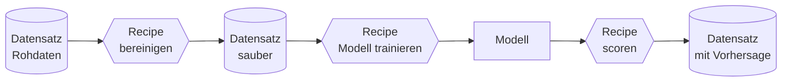

# 9 · AutoML-Plattformen wie Dataiku

!!! abstract "Ziel dieses Kapitels"

    Excel und Power BI reichen für die schnelle Analyse (Kapitel 8) – aber ein Modell, das
    **regelmäßig, nachvollziehbar und im Team** läuft, gehört auf eine eigene Plattform.
    Wir schauen uns **Dataiku** stellvertretend an: seinen **Flow**, ein kleines
    **ML-Beispiel**, den Weg **zurück nach Power BI** und die ehrliche Frage – **wann lohnt
    das überhaupt?**

## 9.1 Warum eine eigene ML-Plattform?

Ein Modell in einer Excel-Zelle ist schnell gebaut – und schnell verloren: Es lebt in
**einer** Datei, auf **einem** Rechner, ohne Historie. Eine **AutoML-Plattform** (Dataiku,
Alteryx, KNIME, DataRobot, Azure ML …) schließt genau diese Lücken:

| Anspruch | Excel / Power BI | AutoML-Plattform |
|---|---|---|
| **Wiederholbar** | manuell, fehleranfällig | Pipeline läuft auf Knopfdruck/Zeitplan |
| **Nachvollziehbar** | Formeln in Zellen | jeder Schritt versioniert & dokumentiert |
| **Teamfähig** | eine Datei, ein Autor | gemeinsamer Arbeitsbereich, Rechte |
| **Modelltiefe** | Regression, Basis-AutoML | viele Algorithmen, Tuning, Deployment |
| **Code optional** | Formeln / etwas Python | **visuell klicken _oder_ Python/R/SQL** |

!!! merksatz "Merksatz"

    Excel fragt **„geht das Modell?"**, eine Plattform fragt **„läuft es auch nächsten
    Monat noch – für alle, nachvollziehbar?"** Der Sprung ist nicht mehr Modell, sondern
    **Betrieb**.

## 9.2 Typische Workflows in Dataiku

Herzstück von Dataiku ist der **Flow** – eine visuelle Landkarte der Daten von der Quelle
bis zum Ergebnis. Zwei Symbole genügen, um ihn zu lesen:

- **Datasets** (runde Knoten) sind Tabellen – egal ob CSV, Datenbank oder Cloud-Bucket.
- **Recipes** (eckige Knoten) sind die **Schritte** dazwischen: *Prepare* (bereinigen,
  wie Power Query), *Join*, *Group*, oder ein **Code-Recipe** in Python/R/SQL. Denselben
  Schritt kann man **klicken oder programmieren** – das ist der Kern von „Code optional".
- Das **Lab** ist die ML-Werkstatt: Zielspalte wählen, Dataiku probiert viele Algorithmen
  durch, vergleicht sie und man **deployt** den Sieger als Modell in den Flow.
- Fertige Modelle werden per **Scoring-Recipe** auf neue Daten angewandt; **Scenarios**
  lassen den ganzen Flow **automatisch** (nach Zeitplan) neu rechnen.

!!! merksatz "Merksatz"

    **Datasets sind Substantive, Recipes sind Verben.** Wer den Flow von links nach rechts
    liest, versteht jedes Dataiku-Projekt – ganz ohne Code.

## 9.3 ML-Beispiel in Dataiku

Angenommen, Velora will vorhersagen, **welche Kunden abwandern** (Churn – eine
**Klassifikation**, Kapitel 6). Der Weg im Flow:

1. **Daten verbinden:** Bestellungen + Kunden als Datasets importieren (CSV/DB).
2. **Prepare-Recipe:** dieselbe Bereinigung wie in Teil 1 – Typen, Formate, Merkmale je
   Kunde bündeln (z. B. Bestellhäufigkeit, letzter Kauf, Ø-Rabatt).
3. **Lab → AutoML:** Zielspalte `abgewandert (ja/nein)` wählen; Dataiku trainiert mehrere
   Modelle (Logistische Regression, Random Forest, Gradient Boosting …) und zeigt eine
   **Rangliste** nach Güte (z. B. ROC-AUC).
4. **Modell prüfen:** Feature-Importance ansehen – **welche Merkmale** treiben die
   Abwanderung? (Das ist die *diagnostische* Frage aus Kapitel 6, nur tiefer.)
5. **Deployen & Scoren:** bestes Modell in den Flow, Scoring-Recipe erzeugt je Kunde eine
   **Wahrscheinlichkeit** – das neue Ergebnis-Dataset.

!!! profi "Profi-Ausblick: AutoML nimmt Arbeit ab, nicht Verantwortung"

    AutoML wählt Algorithmus und Parameter automatisch – die **Fachfragen** bleiben beim
    Menschen: Ist die Zielgröße sauber definiert? Sind Merkmale erlaubt (kein **Data
    Leakage**, das die Zukunft „kennt")? Ist das Modell **fair** und **erklärbar** genug
    für eine Geschäftsentscheidung? Die goldenen Regeln aus Kapitel 6 – Overfitting, Drift,
    Kausalität – gelten auf der Plattform **genauso**.

## 9.4 Von Dataiku zu Power BI

Das Modell rechnet – aber gesehen wird es erst, wenn das Ergebnis im **Bericht** landet.
Vom Scoring-Dataset nach Power BI führen mehrere Wege, von simpel bis robust:

=== "CSV-Export (einfach)"

    Ergebnis-Dataset als **CSV/Excel** exportieren, in Power BI wie in Kapitel 1
    einlesen. Schnell und ohne Setup – aber **manuell** und ohne Aktualisierung. Gut für
    einen **einmaligen** Bericht oder Prototypen.

=== "Datenbank / Data Warehouse (robust)"

    Dataiku schreibt das Ergebnis in eine **SQL-Datenbank** (Snowflake, PostgreSQL, Fabric
    Warehouse …); Power BI verbindet sich direkt. Der Bericht **aktualisiert automatisch**,
    sobald das Scenario neu rechnet – der **Standardweg** im Betrieb.

=== "API / weitere Formate"

    Dataiku kann Modelle als **REST-API** bereitstellen (Live-Scoring) oder Ergebnisse als
    **Parquet**/über **Cloud-Storage** ablegen. Für Power BI zählt: eine **Quelle, die es
    lesen kann** – und die sich **planbar** erneuert.

!!! merksatz "Merksatz"

    **CSV zum Ausprobieren, Datenbank für den Betrieb.** Sobald ein Bericht regelmäßig
    stimmen muss, ersetzt eine automatisch aktualisierte Quelle den Datei-Export.

## 9.5 Dataiku oder Power BI – Vor- und Nachteile

Die Werkzeuge sind **keine Konkurrenten**, sondern **Nachbarn** in derselben Kette: die
Plattform **baut** das Modell, Power BI **erzählt** das Ergebnis.

| | :material-cog-outline: **Dataiku (AutoML-Plattform)** | :material-chart-box: **Power BI** |
|---|---|---|
| **Stärke** | Modelle bauen, Daten-Pipelines, Automatisierung | Berichte, Dashboards, Self-Service |
| **ML-Tiefe** | viele Algorithmen, Tuning, Deployment, Monitoring | fertige KI-Visuals, einfaches AutoML |
| **Zielgruppe** | Data Scientists **und** Fachbereich (Code optional) | Controller & Analysten |
| **Governance** | stark (Versionierung, Rechte, Audit) | über Service/Workspaces |
| **Schwäche** | Lizenz-/Einrichtungsaufwand, Lernkurve | begrenzte ML-Tiefe, kein Modell-Deployment |
| **Kosten** | eigene (oft teure) Plattformlizenz | im M365/Fabric-Umfeld meist vorhanden |

!!! merksatz "Merksatz"

    **Nicht entweder/oder, sondern arbeitsteilig.** Für Trendlinie und Standard-Prognose
    reicht Power BI (Kapitel 8). Für ein produktives, überwachtes Modell lohnt die
    Plattform – und schickt ihr Ergebnis **zurück** in den Power-BI-Bericht.

## 9.6 Gemeinsam (Velora): den Flow lesen

!!! gemeinsam "Am Flow-Diagramm durchdenken"

    Ohne Dataiku-Installation – wir lesen den Flow aus 9.2 gemeinsam und ordnen ein:

1. **Übersetzen:** Welcher Dataiku-Schritt entspricht welchem aus Teil 1? (*Prepare-Recipe*
   ↔ Power Query, *Join-Recipe* ↔ Beziehung im Modell.)
2. **Einordnen:** Ist die Churn-Vorhersage *supervised* oder *unsupervised*, Regression
   oder Klassifikation? (→ Kapitel 6)
3. **Übergabe planen:** Der Bericht soll **täglich** stimmen – **CSV-Export** oder
   **Datenbank**? Begründen Sie.
4. **Entscheiden:** Für „einmal den Umsatztrend zeigen" – Dataiku oder direkt Power BI?

!!! merksatz "Merksatz"

    Die wertvollste Fähigkeit ist nicht, **jedes** Werkzeug zu bedienen, sondern zu wissen,
    **welches** die Aufgabe verlangt – und wo die Übergabestellen liegen.

---

## :material-pencil-ruler: Übungen

{{ task(file="tasks/09_dataiku.yaml") }}

---

!!! abstract "Wiederholung Kapitel 9"

    - **Warum Plattform:** Wiederholbarkeit, Nachvollziehbarkeit, Teamarbeit, Modelltiefe –
      der Sprung von *Modell* zu *Betrieb*.
    - **Flow lesen:** **Datasets** (Tabellen) + **Recipes** (Schritte, klickbar _oder_
      Code); **Lab** trainiert, **Scenarios** automatisieren.
    - **ML-Beispiel:** verbinden → *Prepare* → **AutoML im Lab** → prüfen → **scoren**.
    - **Zu Power BI:** **CSV** zum Ausprobieren, **Datenbank** für den Betrieb, API/Parquet
      als Alternativen.
    - **Arbeitsteilig:** Plattform **baut**, Power BI **erzählt** – kein Entweder/oder.

??? question "Verständnisfragen zu Kapitel 9"

    1. Was ist im Dataiku-**Flow** der Unterschied zwischen einem **Dataset** und einem **Recipe**?
    2. Nennen Sie zwei Gründe, ein Modell auf einer **Plattform** statt in Excel zu bauen.
    3. Welchen **Übergabeweg** nach Power BI wählen Sie für einen **täglich** aktuellen Bericht – und warum?
    4. Was bedeutet „**Code optional**" bei Dataiku?
    5. Ersetzt Dataiku Power BI? Begründen Sie.

    ??? success "Lösungen"

        1. Ein **Dataset** ist eine **Tabelle** (Daten), ein **Recipe** ein **Verarbeitungs­schritt**
           (bereinigen, joinen, trainieren, scoren) dazwischen.
        2. z. B. **Wiederholbarkeit/Automatisierung**, **Nachvollziehbarkeit/Versionierung**,
           **Teamarbeit**, größere **Modelltiefe** (zwei genügen).
        3. Eine **Datenbank/Data-Warehouse-Verbindung** – sie **aktualisiert automatisch**,
           sobald das Scenario neu rechnet; ein CSV-Export müsste man täglich von Hand erneuern.
        4. Jeden Schritt kann man **visuell klicken _oder_** in **Python/R/SQL** schreiben –
           Fachbereich und Data Scientists arbeiten im selben Projekt.
        5. **Nein.** Dataiku **baut und betreibt** Modelle/Pipelines, Power BI **visualisiert
           und verteilt** Ergebnisse. Sie ergänzen sich – die Plattform liefert die Daten,
           die Power BI im Bericht zeigt.
