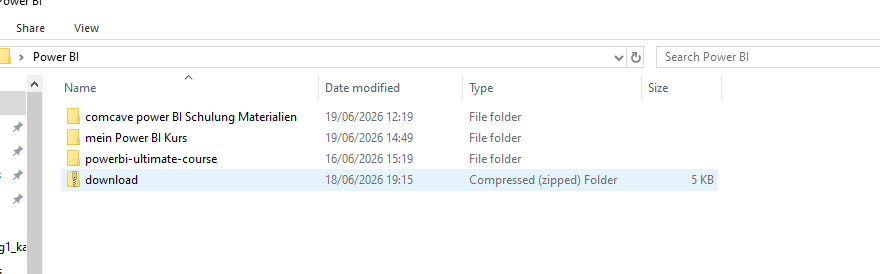
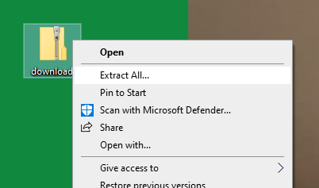
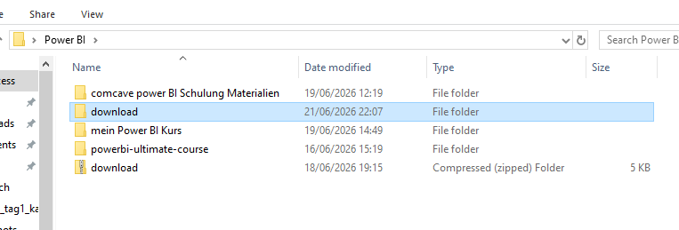
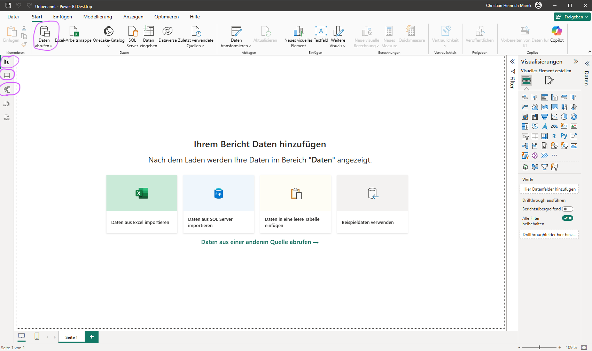
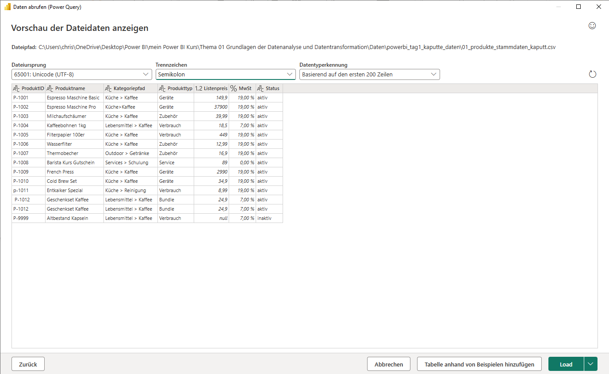
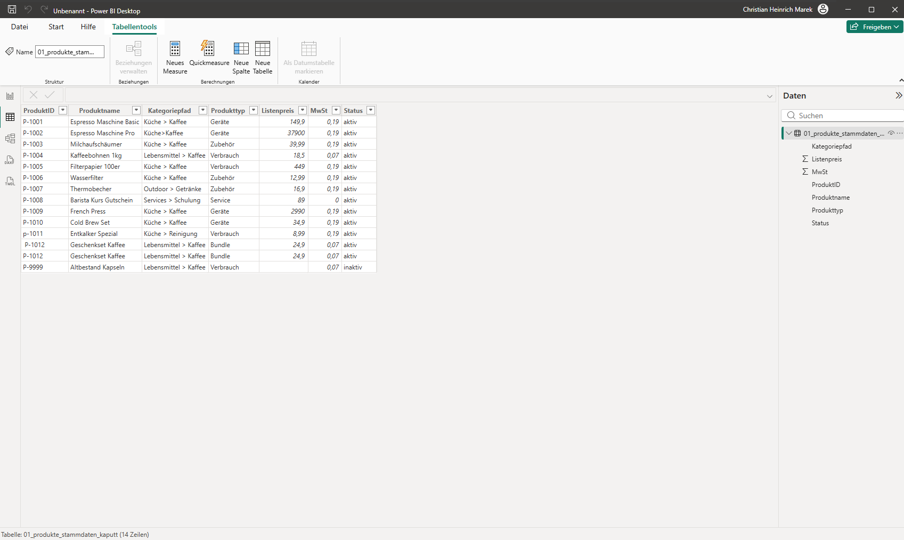
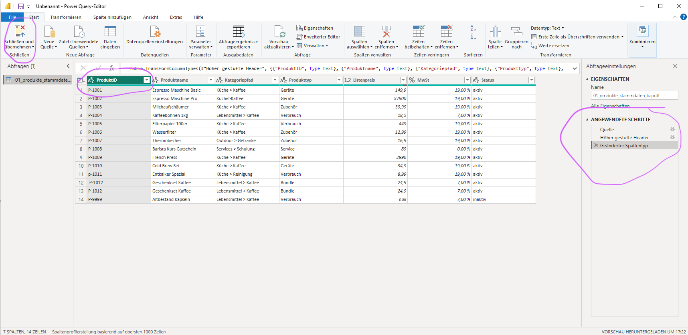
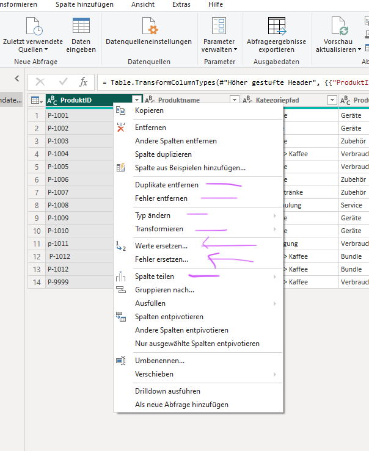

# Schritt für Schritt Anleitung

## .zip Datei entpacken
Häufig liegen Dateien in gepackter Form vor. 
Windows erlaubt es zwar in gepackte Dateien "reinzuschauen", aber durch Doppelklick sind die Dateien NICHT auftomatisch entpackt.

Man muss die Datei vorher mit rechtsklick anklicken und auf extrahieren klicken.

Erst nach dem Entpacken taucht unter Windows im Explorer auch ein Order-Icon auf. 

Jetzt lässt sich die Datei auch in Power BI finden und einlesen.

## Datei einlesen in Power BI
Der Startbildschirm hat mehrere wichtige Stationen:

Dort gibt es...  
- die Ansicht des Berichtes
- die Ansicht der Tabellen
- das Datenmodell

Um die Datei einzulesen man dem Menü folgen, nachdem man im Startbildschirm auf "Daten abrufen" klickt.

Wenn es erfolgreich war, taucht die Tabelle im Programm auf.

## Power Query öffnen
Power Query ist ein wichtiger Bestandteil von Power BI, leider findet man es nicht direk tunter dem Namen, sondern im Menü für "Daten transformieren".

## Spalten transformieren
Einzelne Spalten kann man transformieren, indem man mit der rechten Maustaste auf die Spalte klickt. (es gibt aber auch andere Wege)

## Power Query schließen und anwenden
Hat man mehrere Transformationsschritte fertig definiert, muss man noch Power Query schließen.

## folgende Transformationen sollten bekannt sein

| #  | Transformation                      | Beispiel                                                             |
| -- | ----------------------------------- | -------------------------------------------------------------------- |
| 1  | **Datentyp ändern**                 | Spalte „Umsatz" wird als Text importiert → in Dezimalzahl umwandeln. |
| 2  | **Spalten umbenennen**              | Aus „Column1" wird „Kundenname".                                     |
| 3  | **Zeilen filtern**                  | Nur Verkäufe aus dem Jahr 2025 anzeigen.                             |
| 4  | **Nullwerte ersetzen**              | Leere Werte in „Rabatt" durch 0 ersetzen.                            |
| 5  | **Duplikate entfernen**             | Kundentabelle enthält denselben Kunden mehrfach.                     |
| 6  | **Spalten teilen**                  | „Max Mustermann" → Vorname und Nachname.                             |
| 7  | **Spalten zusammenführen**          | Vorname + Nachname → „Max Mustermann".                               |
| 8  | **Pivotieren**                      | Monate aus Zeilen in Spalten umwandeln.                              |
| 9  | **Entpivotieren (Unpivot)**         | Jan, Feb, Mär-Spalten → Monat- und Wert-Spalte.                      |
| 10 | **Abfragen zusammenführen (Merge)** | Verkäufe mit Kundendaten über Kundennummer verknüpfen.               |
| 11 | **Abfragen anhängen (Append)**      | Verkaufsdaten aus 2024 und 2025 untereinander zusammenführen.        |
| 12 | **Bedingte Spalte erstellen**       | Wenn Umsatz > 10.000 €, dann „Großkunde", sonst „Standardkunde".     |
