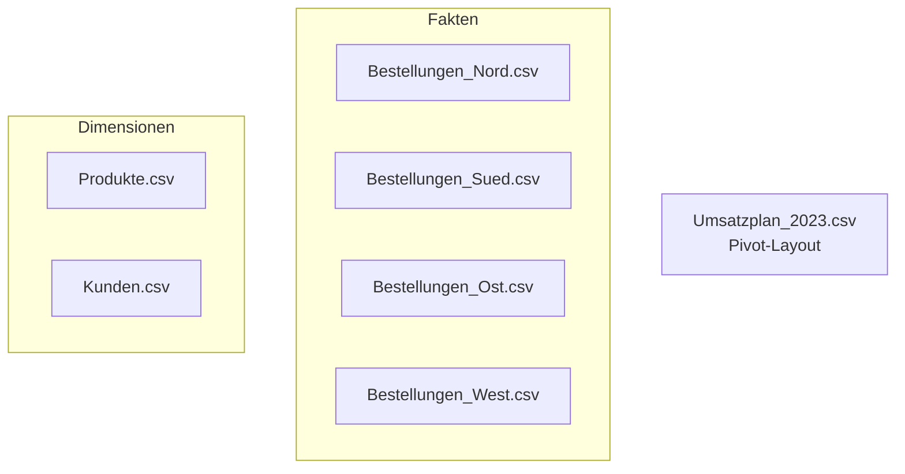

# :material-folder-table: Die zwei Datensätze

Wir arbeiten durchgängig mit **zwei parallel aufgebauten** Datensätzen. Was Sie am
Demo-Datensatz lernen, übertragen Sie 1:1 auf den Übungs-Datensatz.

| Rolle | Firma | Wofür |
|---|---|---|
| :material-cursor-default-click: **Demo** (gemeinsam) | **Velora GmbH** – Fahrrad-Großhandel | Jede Technik wird hier vorgeführt |
| :material-pencil-ruler: **Übung** (selbständig) | **Bürotech GmbH** – Büromaterial-Händler | Gleiche Technik selbst anwenden |

[:material-download: Velora herunterladen](../assets/daten/velora.zip){ .md-button .md-button--primary download }
[:material-download: Bürotech herunterladen](../assets/daten/buerotech.zip){ .md-button download }

!!! warning "Bewusst „schmutzige" Daten"

    Beide Datensätze enthalten **mit Absicht** typische Controlling-Probleme:
    deutsches Zahlen-/Datumsformat, gemischte Schreibweisen, fehlende Schlüssel,
    eine Dublette und einen Plan im Pivot-Layout. Genau das üben wir.

---

## :material-bike: Demo: Velora GmbH

**Geschichte:** Velora ist Fahrrad-Großhändler und beliefert Händler in DACH. Das
Controlling will **Umsatz, Deckungsbeitrag und Plan-Ist** auswerten. Die Daten
kommen als wild gewachsene Dateisammlung:



=== "Bestellungen (Fakten)"

    Spalten: `BestellNr; Datum; KundenNr; ProduktNr; Menge; Einzelpreis; Rabatt`

    ```text title="Auszug Bestellungen_Nord.csv"
    BestellNr;Datum;KundenNr;ProduktNr;Menge;Einzelpreis;Rabatt
    B-50001;28.06.2023;K-008;P-1009;4;252,80;
    B-50002;2023-05-17;K-008;P-1008;5;2.296,72;0,10   ← ISO-Datum!
    B-50004;03.12.2023;K-002;P-1005;16;31,19;0,05
    ```

=== "Produkte (Dimension)"

    Spalten: `ProduktNr; Bezeichnung; Kategorie; Einkaufspreis`

    ```text title="Auszug Produkte.csv – Kategorie uneinheitlich!"
    P-1005;Fahrradhelm AeroSafe;Zubehör;18,50
    P-1006;Satteltasche TourPack;zubehör ;9,90     ← klein + Leerzeichen
    P-1007;Fahrradschloss SecureMax;ZUBEHÖR;14,00   ← GROSS
    P-1003;Rennrad Velocita;fahrrad;760,00          ← klein
    ```

=== "Plan (Pivot)"

    Monate als **Spalten** + Titel- und Summenzeile → muss **entpivotiert** werden.

    ```text title="Auszug Umsatzplan_2023.csv"
    Velora GmbH – Umsatzplan 2023 (in EUR);;;...
    ;;;...
    Kategorie;Jan;Feb;Mrz;...;Dez
    Fahrrad;100.000;91.700;83.800;...;87.600
    Summe;260.700;256.800;225.700;...;232.800
    ```

**Eingebaute Stolperfallen:** Semikolon/Komma-Format · einzelne ISO-Datumszeilen ·
leere Rabatte · uneinheitliche Kategorie · eine Dublette (Nord) · eine fehlende
ProduktNr · Pivot-Plan.

---

## :material-printer: Übung: Bürotech GmbH

**Geschichte:** Bürotech verkauft Büromaterial an Kanzleien, Behörden und Firmen.
Aufgabe **identisch** zu Velora. Struktur bewusst analog – aber mit anderen Namen,
damit Sie das **Muster** erkennen statt eine Klick-Anleitung auswendig zu lernen.

| Bei Velora … | … heißt es bei Bürotech |
|---|---|
| Bestellungen (je **Region**) | Aufträge (je **Quartal**) |
| Produkte / **Kategorie** | Artikel / **Warengruppe** |
| Kunde / **Segment** | Kunde / **Branche** |

=== "Aufträge (Fakten)"

    Spalten: `AuftragNr; Datum; KundenNr; ArtikelNr; Menge; Listenpreis; Rabatt`

    ```text title="Auszug Auftraege_Q1.csv"
    AuftragNr;Datum;KundenNr;ArtikelNr;Menge;Listenpreis;Rabatt
    AU-7001;27.02.2023;F-03;A-201;39;3,07;0,12
    AU-7002;01.02.2023;F-07;A-202;49;7,76;
    ```

=== "Besonderheiten"

    - Aufteilung nach **Quartal** (`Q1`…`Q4`) statt Region.
    - Eine Zeile mit Datumsformat `15/03/2023` (Schrägstriche).
    - Warengruppe uneinheitlich (`technik`, `SCHREIBGERÄTE`, `papier `).
    - Eine fehlende ArtikelNr; Plan ebenfalls im Pivot-Layout.

---

!!! profi "Woher kommen die Daten?"

    Die Rohdaten werden deterministisch von einem kleinen Python-Skript erzeugt
    (`daten/_generator.py` im Projekt). In echten Häusern stammen sie aus
    ERP-Exporten, Excel-Listen einzelner Abteilungen oder einem Data Warehouse –
    die **Probleme** sind aber genau dieselben, die wir hier üben.
