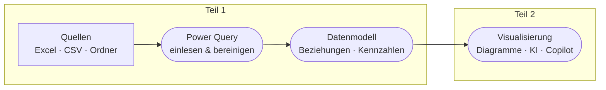

---
hide:
  - navigation
  - toc
---

# :material-chart-areaspline: Power BI Schulung

## Von den Rohdaten zum Modell – und weiter zu Visualisierung, KI & Copilot

Willkommen! Diese Schulung begleitet **Controlling-Mitarbeiter** in zwei Teilen:
**Teil 1** baut das Modell (**einlesen → transformieren → Datenmodell**), **Teil 2**
macht daraus **Auswertung, Vorhersage und KI-gestützte Analyse** – Schritt für Schritt,
an zwei durchgängigen Beispielen.

!!! abstract "Was Sie hier erwartet"

    - :material-cursor-default-click: **Mitmach-Demo** am Beispiel *Velora GmbH* – wir bauen alles gemeinsam.
    - :material-pencil-ruler: **Übungen** am Beispiel *Bürotech GmbH* – Sie wenden es selbst an.
    - :material-lightbulb-on: **Merksätze**, :material-rocket-launch: **Profi-Ausblicke** und ❓ **Verständnisfragen** in jedem Kapitel.
    - :material-flag-checkered: **Teil 1** führt bis zum **fertigen Datenmodell**; **Teil 2** baut darauf **Visualisierung, Machine Learning & KI und Copilot** auf.

**Teil 1 – Vom Rohdatensatz zum Modell**

- [:material-folder-table: **Datensätze & Download**](content/datensaetze.md)
- [:material-school: **0 · Grundlagen**](content/00-grundlagen.md)
- [:material-database-import: **1 · Daten einlesen**](content/01-einlesen.md)
- [:material-auto-fix: **2 · Daten transformieren**](content/02-transformieren.md)
- [:material-star-four-points: **3 · Datenmodell erstellen**](content/03-datenmodell.md)
- [:material-check-decagram: **4 · Abschluss & Checkliste**](content/04-abschluss.md)

**Teil 2 – Auswertung, Vorhersage & KI**

- [:material-chart-box: **5 · Visualisierung**](content/05-visualisierung.md)
- [:material-brain: **6 · Machine Learning & KI**](content/06-machine-learning-ki.md)
- [:material-robot-happy: **7 · Copilot & Datenanalyse**](content/07-copilot.md)

---

### :material-map-marker-path: Der rote Faden

!!! tip "Schneller navigieren"

    ++p++ oder ++comma++ : vorherige Seite (**P**revious)

    ++n++ oder ++period++ : nächste Seite (**N**ext)

    ++s++ : Suche öffnen

[:material-download: Velora-Datensatz](assets/daten/velora.zip){ .md-button .md-button--primary download }
[:material-download: Bürotech-Datensatz](assets/daten/buerotech.zip){ .md-button download }
